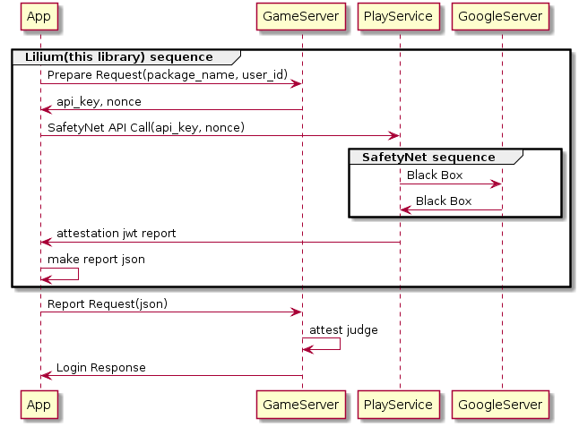
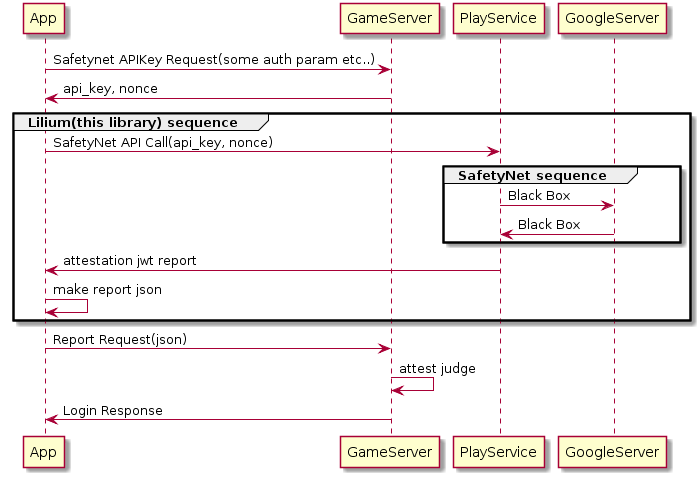

=============================================

[](https://jitpack.io/#mofneko/Lilium)

Lilium is a lightweight wrapper library that allows you to use the SafetyNet Attestation API provided by Google more effectively and easily. It is compatible with Unity.

[Here](https://github.com/mofneko/Lilium/blob/master/README_JP.md) is the Japanese version of the document.

# Philosophy of Lilium

This library is mainly effective for falsification of applications.
The following items are actually listed in the Report file returned by executing the SafetyNet API:

```
nonce
Time stamp
SHA-256 hash of the APK certificate
SHA-256 hash of the APK
```

By verifying, it is possible to detect that an APK file is being executed by a malicious user.
Refer to the following for each item described in the Report file.

```
 ・nonce
Nonce is a byte array passed as an argument when Lilium initialization processing is executed, and this value is included in SafetyNetReport as it is. The significance of this value is that, for example, a malicious user executes a verification process in advance with a normal non-tampered application, copies the contents of the report, and sends the report that is sent to the server with the tampered application to a normal system. Replacing can prevent hacks that pass the check by using nonce as a one-time token.
 ・timestamp
The time when the report was created by SafetyNet is recorded. This value is usually the same time as the Lilium report creation time. If it is too far away, the above fraud may have been implemented, so library users should also verify this value.
 ・SHA-256 hash of APK certificate
Usually, a certificate signed with the developer's private key is required to run APK on an Android device. The same applies when a falsifier falsifies an APK file. Unless there is a situation where the developer's private key is leaked to the falsifier, it is signed with the falsifier's private key. The signature file has a different hash. The main purpose of this library is to verify falsification by checking this value.
 ・SHA-256 hash of APK
A hash of the APK file itself. Needless to say, tampering can be determined using the property that the hash of the APK file is different before and after tampering. However, since this value fluctuates with each release, it costs operation. As long as the developer's private key is not leaked as explained in the SHA-256 hash of the APK certificate, it is safe to skip this value check.
```

The contents of the complete Report file issued by SafetyNet are shown below.

```
{
  "timestampMs": 9860437986543,
  "nonce": "R2Rra24fVm5xa2Mg",
  "apkPackageName": "com.package.name.of.requesting.app",
  "apkCertificateDigestSha256": ["base64 encoded, SHA-256 hash of the
                                  certificate used to sign requesting app"],
  "ctsProfileMatch": true,
  "basicIntegrity": true,
}
```

### LiliumReport structure

Lilium creates a report that wraps the Report file issued from the SafetyNet API and returns it to the executing application.
This has the purpose of reporting more details to the server compared to the original Report. Please do not interpret the report returned as a return value inside the application. This has the risk of leaving room for tampering.
Send the complete report to the server once. It is recommended to send an appropriate approach from the server to the app after sending the report.

Note: Since the value of Report generated from Lilium is Json, it may be tampered with other than the included SafetyNet Report. Lilium sends an error report to the server when SafetyNet fails, and the client application provides a material for determining the situation at the time of the error so that the client application can provide an appropriate approach to the error that occurred to the non-malicious user Please do not deviate from the category used for the purpose of acquisition.

# What is SafetyNet Attestation API?

The SafetyNet Attestation API helps you assess the security and compatibility of the Android environments in which your apps run. You can use this API to analyze devices that have installed your app.

## Architecture
The overall SafetyNet Attestation protocol, which appears in Figure 1, involves the following steps:

1. Your app makes a call to the SafetyNet Attestation API.
2. The API requests a signed response using its backend.
3. The backend sends the response to Google Play services.
4. The signed response is returned to your app.
5. Your app should forward the signed response to a server that you trust.
6. The server verifies the response and sends the result of the verification process back to your app.


Figure 1. SafetyNet Attestation API protocol

7. After completing these steps, if the result indicates that the device has passed your app's risk-model evaluation, your app can resume its services.

# Prepare in advance: Issuance and extension of API key

By default, API keys for using SafetyNetAPI have an upper limit of 10,000 requests per day. However, this can be raised for free by applying.

1. Go to the [Library page](https://console.developers.google.com/apis/library) in the Google APIs Console.
2. Search for the Android Device Verification API. When you've found the API, click on it. The Android Device Verification API dashboard screen appears.
3. If the API isn't already enabled, click Enable.
4. If the Create credentials button appears, click on it to generate an API key. Otherwise, click the All API credentials drop-down list and select the API key that is associated with the project for which the Android Device Verification API is enabled.
5. In the sidebar on the left, click Credentials. Copy the API key that appears.

6. Use this API key whenever you call the attest() method of the SafetyNetClient class.

7. After reviewing all the relevant documentation for this API—including best practices—estimate the number of calls your app might make to the API. If you need to make more than 10,000 requests per day across all API keys in your project, [fill out this quota request form](https://support.google.com/googleplay/android-developer/contact/safetynetqr).


# Lilium recommended sequence diagram

##### When using the library built-in prepare request to get the APIKey and nonce from your own server



```plantuml
group Lilium(this library) sequence
"App" -> GameServer : Prepare Request(package_name, user_id)
GameServer -> "App" : api_key, nonce

"App" -> "PlayService" : SafetyNet API Call(api_key, nonce)

group SafetyNet sequence
"PlayService" -> GoogleServer : Black Box
GoogleServer -> "PlayService" : Black Box
end

"PlayService" -> "App" : attestation jwt report

"App" -> "App" : make report json
end

"App" -> GameServer : Report Request(json)
GameServer -> GameServer : attest judge
GameServer -> "App" : Login Response
```

or, you can omit the prepare request and execute only attest by specifying the APIKey and nonce required for Safetynet.

##### When directly specifying APIKey and nonce



```
"App" -> GameServer : Safetynet APIKey Request(some auth param etc..)
GameServer -> "App" : api_key, nonce

group Lilium(this library) sequence
"App" -> "PlayService" : SafetyNet API Call(api_key, nonce)

group SafetyNet sequence
"PlayService" -> GoogleServer : Black Box
GoogleServer -> "PlayService" : Black Box
end

"PlayService" -> "App" : attestation jwt report

"App" -> "App" : make report json
end

"App" -> GameServer : Report Request(json)
GameServer -> GameServer : attest judge
GameServer -> "App" : Login Response
```

# How to use

##### Java and Kotlin

Users of your library will need add the jitpack.io repository:

```gradle
allprojects {
 repositories {
    jcenter()
    maven { url "https://jitpack.io" }
 }
}
```

and:

```gradle
dependencies {
    compile 'com.github.mofneko:Lilium:2.8.0'
}
```

Step1. Handling SafetyNetDelegate

```kotlin
            val attestCallback = object : DefaultAttestCallback() {
                override fun onResult(response: String) {
                    // Report json here.
                }
            }
```

When executing in the sequence [When using the library built-in prepare request to get the APIKey and nonce from your own server
](https://github.com/mofneko/Lilium#when-using-the-library-built-in-prepare-request-to-get-the-apikey-and-nonce-from-your-own-server).

Step2. Attest

```kotlin
            Lilium().attest(this, "BASE_URI_HERE", "USERID_HERE", attestCallback)
```

Or, when only attest is executed in the sequence [When directly specifying APIKey and nonce](https://github.com/mofneko/Lilium#when-directly-specifying-apikey-and-nonce).

Step2. Attest

```kotlin
            Lilium().attest(this, "USERID_HERE", "API_KEY_HERE", "NONCE_HERE", attestCallback)
```

Note: SafetyNet uses some of the functions of PlayService. If the PlayService app that is normally installed on the device is blocking the execution in some way, it is necessary to present appropriate guidelines to the user. The Lilium library can display a dialog with the following line giving the user a description and routing of the situation.

```kotlin
            Lilium().showErrorPlayService(this)
```

##### C# (Unity)
Create a folder with the structure Assets/Plugins/Android and put [*.aar](https://github.com/mofneko/Lilium/blob/master/aar/) in the Android folder.

and fact Delegate.

*Note: Using the callback function in Unity Android Plugin means that the main thread ID is changed after the event fires. Please consider how to return to the main thread.*

```C# (Unity)
　　public class AttestListener : AndroidJavaProxy
    {
        public AttestListener()
            : base("com.nekolaboratory.Lilium.DefaultAttestCallback")
        {
        }
        void onResult(string response){
                    // Report json here.
        }
    }
```

and execute Attest.

When executing in the sequence [When using the library built-in prepare request to get the APIKey and nonce from your own server
](https://github.com/mofneko/Lilium#when-using-the-library-built-in-prepare-request-to-get-the-apikey-and-nonce-from-your-own-server).

```C# (Unity)
    void Attest()
    {
        // Step1. Instantiate
        using (AndroidJavaObject Lilium = new AndroidJavaObject("com.nekolaboratory.Lilium.Lilium"))
        {
        // Step2. Attest
         Lilium.Call("attest", "BASE_URI_HERE", "USERID_HERE", new AttestListener());
        }
    }
```

Or, when only attest is executed in the sequence [When directly specifying APIKey and nonce](https://github.com/mofneko/Lilium#when-directly-specifying-apikey-and-nonce).

```C# (Unity)
    void Attest()
    {
        // Step1. Instantiate
        using (AndroidJavaObject Lilium = new AndroidJavaObject("com.nekolaboratory.Lilium.Lilium"))
        {
        // Step2. Attest
         Lilium.Call("attest", "USERID_HERE", "API_KEY_HERE", "NONCE_HERE", new AttestListener());
        }
    }
```

Note: SafetyNet uses part of the PlayService functionality. Normally, if the PlayService application installed on the device is obstructing the execution in some way, it is necessary to provide appropriate guidelines to the user. The Lilium library can display a dialog that provides the user with a description of the situation and routing on the next line.

```C# (Unity)
    void Attest()
    {
        using (AndroidJavaObject Lilium = new AndroidJavaObject("com.nekolaboratory.Lilium.Lilium"))
        {
         Lilium.Call("showErrorPlayService");
        }
    }
```

# Server side flow
To use the Lilium library, you need to implement an appropriate API on the server side. Many services can easily implement the following two APIs:

## prepare api(get API key, nonce)

### endpoint

- https://BASE_URI/prepare

Note: BASE_URI can be customized as you like, including the schema.

### Request

```
POST
Content-Type: application/json

{
  "user_id": "Normally, a character string for identifying the user who sent the request to determine the consistency of the APK is received here. Since the value here can be any String, the usage is as described above. Not.",
  "package_name": "You will receive the package name of the application, because if the APK file is divided into different package names for the test and the production, the API key can be sorted by the package name received here."
}
```

### Response

#### on Success

```
200 OK
Content-Type: application/json

{
  "api_key": "Please return the API key issued in advance preparation items.",
  "nonce": "nonce (Base64 Encorded)"
}
```

#### on Faild

If there is an exception such as the PlayService server is down, please indicate an error as the status code here. It can be decided freely in the range of 400s and 500s. If the server returns these abnormal codes, Lilium will include the error status in the report below. At that time, the content of the body is included in atn_error_msg, so if there is any supplementary matter, output it here.

## attestation

Please implement the receiver of the report output by Lilium.

### endpoint

Note: The following endpoints are examples. Lilium creates a report and returns the report to the application that executed it, so you can send it to the server at any time.

- https://BASE_URI/report

### Request

```
POST
Content-Type: application/json

{
  "user_id": "The user_id returned by prepare is included. As a usage method, it can be used to determine whether the user who requested prepare has sent the report in the correct flow.",
  "package_name": "Contains the application package name.",
  "ver": "The Lilium library version is included. If this library contains bugs or vulnerabilities, it will be updated, so make sure that the server-side library is up-to-date. Is recommended. ",
  "atn": "The Report JWT generated by the Safetynet attestation API is included as a string.",
  "atn_error": "If an error occurs before checking the APK with SafetyNet, the following error code is included here. In such a situation, the JWT corresponding to the atn property will be empty. . ",
  "atn_error_msg": "If there is a situation where the error code is included in atn_error, if there is supplementary information, this information will be included here. As a specific example, the cause when there was a problem with PlayService or the server in the prepare request The contents of the body when the status code corresponding to the error is returned are included here. "
}
```

#### About atn_error

- `PREPARE_RETURNS_4XX` prepare returned 400 group error.
- `PREPARE_RETURNS_5XX` prepare returned 500 group error.
- `PREPARE_UNEXPECTED_ERROR` prepare another error.
- `PLAY_SERVICE_UNAVAILABLE` Play Service disabled. (need dialog notice)
- `ATTEST_API_ERROR_%s` `attest` returned ApiException.`%s`equals`ApiException#getStatusCode` [See](https://developers.google.com/android/reference/com/google/android/gms/common/api/CommonStatusCodes.html).
- `ATTEST_UNEXPECTED_ERROR` `attest` another error.
- `UNEXPECTED_ERROR` another error.

#### About atn_error_msg when PLAY_SERVICE_UNAVAILABLE

- `PLAY_SERVICE_ERROR_MISSING` PlayService is not installed on the terminal.
- `PLAY_SERVICE_ERROR_UPDATING` The required version for handling SafetyNet is not cleared.
- `PLAY_SERVICE_ERROR_VERSION_UPDATE_REQUIRED` The required version for handling SafetyNet has not been cleared.
- `PLAY_SERVICE_ERROR_DISABLED` PlayService is frozen by the user.
- `PLAY_SERVICE_ERROR_INVALID` The PlayService module is invalid.

# Development

```
$ git clone git@github.com:mofneko/Lilium.git
$ cd Lilium
$ ./gradlew assembleRelease
```

# License

```
MIT License

Copyright (c) 2020 Yusuke Arakawa

Permission is hereby granted, free of charge, to any person obtaining a copy
of this software and associated documentation files (the "Software"), to deal
in the Software without restriction, including without limitation the rights
to use, copy, modify, merge, publish, distribute, sublicense, and/or sell
copies of the Software, and to permit persons to whom the Software is
furnished to do so, subject to the following conditions:

The above copyright notice and this permission notice shall be included in all
copies or substantial portions of the Software.

THE SOFTWARE IS PROVIDED "AS IS", WITHOUT WARRANTY OF ANY KIND, EXPRESS OR
IMPLIED, INCLUDING BUT NOT LIMITED TO THE WARRANTIES OF MERCHANTABILITY,
FITNESS FOR A PARTICULAR PURPOSE AND NONINFRINGEMENT. IN NO EVENT SHALL THE
AUTHORS OR COPYRIGHT HOLDERS BE LIABLE FOR ANY CLAIM, DAMAGES OR OTHER
LIABILITY, WHETHER IN AN ACTION OF CONTRACT, TORT OR OTHERWISE, ARISING FROM,
OUT OF OR IN CONNECTION WITH THE SOFTWARE OR THE USE OR OTHER DEALINGS IN THE
SOFTWARE.
```
