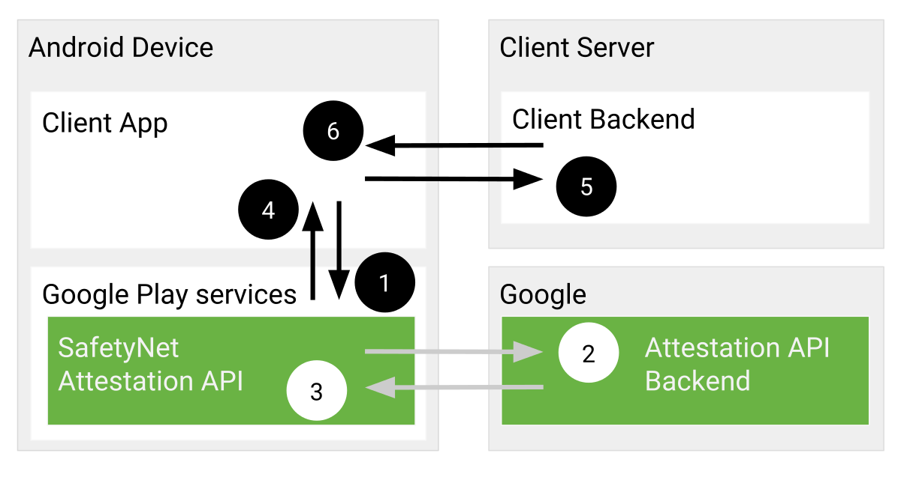
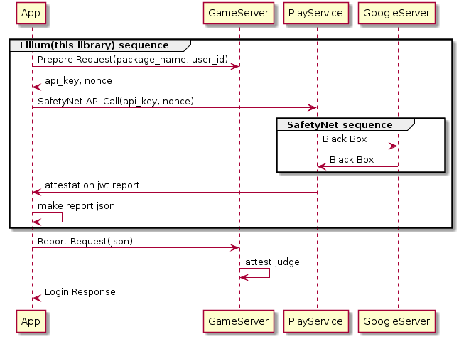
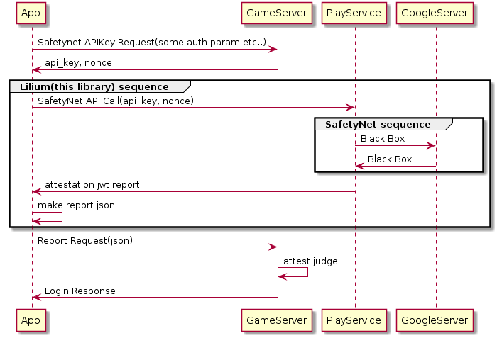

=============================================

[](https://jitpack.io/#mofneko/Lilium)

LiliumはGoogleによって提供されているSafetyNet Attestation APIをより効果的かつ，簡単に使用するための軽量なラッパーライブラリです. Unityと互換性があります.

# Liliumの哲学

このライブラリは主にアプリケーションの改竄対策に有効です．
実際にはSafetyNet APIを実行することによって返却されるReportファイルに記載されている以下の項目：

```
nonce
タイムスタンプ
APK証明書のSHA-256ハッシュ
APKのSHA-256ハッシュ
```

を検証することでAPKファイルが悪意のあるユーザーによって改竄された状態で実行されていることを検出可能にします．
Reportファイルに記載されている，それぞれの項目に対しては下記を参照してください．

```
 ・nonce
nonceはLiliumの初期化処理実行時に引数として渡すバイト配列で，この値がそのまま，SafetyNetReport内部に内包されて入ってきます．この値の存在意義としては，例えば悪意のあるユーザーが，事前に正常な非改竄アプリで検証処理を実行して，Report内容をコピーし，改竄アプリでサーバーに送信するReportを正常系のものに置換することでチェックをパスするハックをnonceをワンタイムトークンとして使用することで阻止することができます．
 ・timestamp
SafetyNetによってReportが作成された時間が記録されています．この値は通常，LiliumのReport作成時刻と相違がない時間となっています．あまりにかけはなれている場合は，上記の不正が施されている可能性があるので，ライブラリのユーザーはこの値も検証するようにしてください．
 ・APK証明書のSHA-256ハッシュ
通常，APKをAndroid端末で実行するには開発者の秘密鍵で署名された証明書が必要です．改竄者がAPKファイルを改竄した場合にもそれは同様で，ディベロッパーの秘密鍵が改竄者に流出でもするような事態がない限り，改竄者の秘密鍵で署名がされるので非改竄APKと改竄APKで署名ファイルのハッシュが異なります．当ライブラリはこの値をチェックすることによって改竄の検証を行うことをメインにしています．
 ・APKのSHA-256ハッシュ
APKファイル本体のハッシュになります．これは説明するまでもなく，改竄前と改竄後でAPKファイルのハッシュが異なる性質を利用して改竄の判定を行うことができます．しかし，リリース毎にこの値が変動するので運用のコストがかかります．APK証明書のSHA-256ハッシュの説明のようにディベロッパーの秘密鍵が流出している可能性でもない限りはこの値のチェックをスキップしても問題ないと考えられます．
```

SafetyNetから発行される完全なReportファイルの内容を下記に示します．

```
{
  "timestampMs": 9860437986543,
  "nonce": "R2Rra24fVm5xa2Mg",
  "apkPackageName": "com.package.name.of.requesting.app",
  "apkCertificateDigestSha256": ["base64 encoded, SHA-256 hash of the
                                  certificate used to sign requesting app"],
  "ctsProfileMatch": true,
  "basicIntegrity": true,
}
```

### LiliumReportの構造

LiliumはSafetyNet APIから発行されるReportファイルをラップしたReportを作成し，実行元アプリに返却します．
これはオリジナルのReportと比較して，より詳細をサーバーに報告するという目的があります．ライブラリ実行元アプリケーションは戻り値として返却されるReportをアプリ内部で解釈しないでください．これは改竄者に改竄の余地を与えてしまうリスクがあります．
一度，完全なReportをサーバーに送信してください．Report送信後にサーバーからアプリに対して適切なアプローチを指示することを推奨します．

注意： Liliumから生成されるReportの値はJsonなので内包しているSafetyNetのReport以外は改竄される可能性があります．LiliumはSafetyNetが失敗した際にエラーReportをサーバーに送信して，悪意のないユーザーに発生したエラーに対してクライアントアプリケーションが適切なアプローチを提供するためのエラー発生時の状況判断のための材料を取得する目的で使用する範疇を逸脱しないように扱ってください．

# SafetyNet Attestation APIとは?

SafetyNet Attestation API は，アプリが動作している Android デバイスをアプリのデベロッパーが評価するための不正利用防止 API です．この API は，不正利用検出システムの一部として，サーバーとやり取りしているのが正規の Android デバイスで動作している正規のアプリかどうかを判断するために使用します．

## Architecture
SafetyNet Attestation API では，次のワークフローが使用されます．

1. SafetyNet Attestation API がアプリからの呼び出しを受けます．この呼び出しには nonce が含まれます．
2. SafetyNet Attestation サービスは，ランタイム環境を評価し，Google のサーバーに評価結果の署名済み構成証明をリクエストします．
3. Google のサーバーは，署名済み構成証明をデバイスの SafetyNet Attestation サービスに送信します．
4. SafetyNet Attestation サービスは，この署名済み構成証明をアプリに返します．
5. アプリは署名済み構成証明をご自身のサーバーに転送します．
6. このサーバーはレスポンスを検証し，不正利用防止の判断に使用します．ご自身のサーバーが調査結果をアプリに伝えます．
このプロセスをFigure 1に示します．



Figure 1. SafetyNet Attestation API プロトコル

7. After completing these steps, if the result indicates that the device has passed your app's risk-model evaluation, your app can resume its services.

# 事前に準備すること: API keyの発行と拡張

SafetyNetAPIを使用するためのAPIキーはデフォルトで1日1万件のリクエストまでの上限があります．しかし，これは申請することによって無料で上限の引き上げを行うことができます．

SafetyNet Attestation API のメソッドを呼び出すには，API キーを使用する必要があります．キーを作成して埋め込む手順は次のとおりです．

1. Google API Console の[ライブラリ](https://console.developers.google.com/apis/library) ページに移動します．
2. 「Android Device Verification API」を検索して選択します．Android Device Verification API ダッシュボードの画面が表示されます．
3. API がまだ有効になっていない場合は，[有効にする] をクリックします．
4. [認証情報を作成] ボタンが表示された場合は，それをクリックして API キーを生成します．表示されなかった場合は，[すべての API 認証情報] プルダウン リストをクリックしてから，Android Device Verification API を有効にしたプロジェクトに関連付けられている API キーを選択します．
5. 左のサイドバーで，[認証情報] をクリックします．表示された [API キー] をコピーします．
6. この API キーは，SafetyNetClient クラスの attest() メソッドを呼び出すときに使用します．
7. After reviewing all the relevant documentation for this API—including best practices—estimate the number of calls your app might make to the API. If you need to make more than 10,000 requests per day across all API keys in your project, [fill out this quota request form](https://support.google.com/googleplay/android-developer/contact/safetynetqr).


# Liliumの推奨するシーケンス・ダイアグラム

##### ライブラリ内蔵のprepareリクエストを使ってAPIKeyとnonceを自前のサーバーから取得する場合



```plantuml
group Lilium(this library) sequence
"App" -> GameServer : Prepare Request(package_name, user_id)
GameServer -> "App" : api_key, nonce

"App" -> "PlayService" : SafetyNet API Call(api_key, nonce)

group SafetyNet sequence
"PlayService" -> GoogleServer : Black Box
GoogleServer -> "PlayService" : Black Box
end

"PlayService" -> "App" : attestation jwt report

"App" -> "App" : make report json
end

"App" -> GameServer : Report Request(json)
GameServer -> GameServer : attest judge
GameServer -> "App" : Login Response
```

または，Safetynetに必要なAPIKeyとnonceを指定することでprepareリクエストを省略してattestだけを実行することもできます．

##### 直接APIKeyとnonceを指定する場合



```
"App" -> GameServer : Safetynet APIKey Request(some auth param etc..)
GameServer -> "App" : api_key, nonce

group Lilium(this library) sequence
"App" -> "PlayService" : SafetyNet API Call(api_key, nonce)

group SafetyNet sequence
"PlayService" -> GoogleServer : Black Box
GoogleServer -> "PlayService" : Black Box
end

"PlayService" -> "App" : attestation jwt report

"App" -> "App" : make report json
end

"App" -> GameServer : Report Request(json)
GameServer -> GameServer : attest judge
GameServer -> "App" : Login Response
```

# ライブラリの使い方

##### Java and Kotlin

Users of your library will need add the jitpack.io repository:

```gradle
allprojects {
 repositories {
    jcenter()
    maven { url "https://jitpack.io" }
 }
}
```

and:

```gradle
dependencies {
    compile 'com.github.mofneko:Lilium:2.8.2'
}
```

Step1. Handling SafetyNetDelegate

```kotlin
            val attestCallback = object : DefaultAttestCallback() {
                override fun onResult(response: String) {
                    // Report json here.
                }
            }
```

[ライブラリ内蔵のprepareリクエストを使ってAPIKeyとnonceを自前のサーバーから取得する場合](https://github.com/mofneko/Lilium/blob/master/README_JP.md#%E3%83%A9%E3%82%A4%E3%83%96%E3%83%A9%E3%83%AA%E5%86%85%E8%94%B5%E3%81%AEprepare%E3%83%AA%E3%82%AF%E3%82%A8%E3%82%B9%E3%83%88%E3%82%92%E4%BD%BF%E3%81%A3%E3%81%A6apikey%E3%81%A8nonce%E3%82%92%E8%87%AA%E5%89%8D%E3%81%AE%E3%82%B5%E3%83%BC%E3%83%90%E3%83%BC%E3%81%8B%E3%82%89%E5%8F%96%E5%BE%97%E3%81%99%E3%82%8B%E5%A0%B4%E5%90%88)のシーケンスで実行する場合，

Step2. Attest

```kotlin
            Lilium().attest(this, "BASE_URI_HERE", "USERID_HERE", attestCallback)
```

または[直接APIKeyとnonceを指定する場合](https://github.com/mofneko/Lilium/blob/master/README_JP.md#%E7%9B%B4%E6%8E%A5apikey%E3%81%A8nonce%E3%82%92%E6%8C%87%E5%AE%9A%E3%81%99%E3%82%8B%E5%A0%B4%E5%90%88)のシーケンスでattestのみを実行する場合，

Step2. Attest

```kotlin
            Lilium().attest(this, "USERID_HERE", "API_KEY_HERE", "NONCE_HERE", attestCallback)
```

注意： SafetyNetはPlayServiceの機能の一部を利用しています．通常は端末にインストールされているPlayServiceアプリが何らかの形で実行の妨げになっている場合は，ユーザーに対して適切なガイドラインを提示する必要があります．Liliumライブラリは次の一行でユーザーに状況の説明とルーティングを提供するダイアログを表示することができます．

```kotlin
            Lilium().showErrorPlayService(this)
```

##### C# (Unity)
Create a folder with the structure Assets/Plugins/Android and put [*.aar](https://github.com/mofneko/Lilium/blob/master/aar/) in the Android folder.

and fact Delegate.

*注意： UnityのAndroid Pluginでコールバック関数を使うことはイベント発火後メインスレッドIDを変更されることを意味します． メインスレッドに戻す方法を検討してください．*

```C# (Unity)
　　public class AttestListener : AndroidJavaProxy
    {
        public AttestListener()
            : base("com.nekolaboratory.Lilium.DefaultAttestCallback")
        {
        }
        void onResult(string response){
                    // Report json here.
        }
    }
```

and execute Attest.

[ライブラリ内蔵のprepareリクエストを使ってAPIKeyとnonceを自前のサーバーから取得する場合](https://github.com/mofneko/Lilium/blob/master/README_JP.md#%E3%83%A9%E3%82%A4%E3%83%96%E3%83%A9%E3%83%AA%E5%86%85%E8%94%B5%E3%81%AEprepare%E3%83%AA%E3%82%AF%E3%82%A8%E3%82%B9%E3%83%88%E3%82%92%E4%BD%BF%E3%81%A3%E3%81%A6apikey%E3%81%A8nonce%E3%82%92%E8%87%AA%E5%89%8D%E3%81%AE%E3%82%B5%E3%83%BC%E3%83%90%E3%83%BC%E3%81%8B%E3%82%89%E5%8F%96%E5%BE%97%E3%81%99%E3%82%8B%E5%A0%B4%E5%90%88)のシーケンスで実行する場合，

```C# (Unity)
    void Attest()
    {
        // Step1. Instantiate
        using (AndroidJavaObject Lilium = new AndroidJavaObject("com.nekolaboratory.Lilium.Lilium"))
        {
        // Step2. Attest
         Lilium.Call("attest", "BASE_URI_HERE", "USERID_HERE", new AttestListener());
        }
    }
```

または[直接APIKeyとnonceを指定する場合](https://github.com/mofneko/Lilium/blob/master/README_JP.md#%E7%9B%B4%E6%8E%A5apikey%E3%81%A8nonce%E3%82%92%E6%8C%87%E5%AE%9A%E3%81%99%E3%82%8B%E5%A0%B4%E5%90%88)のシーケンスでattestのみを実行する場合，

```C# (Unity)
    void Attest()
    {
        // Step1. Instantiate
        using (AndroidJavaObject Lilium = new AndroidJavaObject("com.nekolaboratory.Lilium.Lilium"))
        {
        // Step2. Attest
         Lilium.Call("attest", "USERID_HERE", "API_KEY_HERE", "NONCE_HERE", new AttestListener());
        }
    }
```

注意： SafetyNetはPlayServiceの機能の一部を利用しています．通常は端末にインストールされているPlayServiceアプリが何らかの形で実行の妨げになっている場合は，ユーザーに対して適切なガイドラインを提示する必要があります．Liliumライブラリは次の一行でユーザーに状況の説明とルーティングを提供するダイアログを表示することができます．

```C# (Unity)
    void Attest()
    {
        using (AndroidJavaObject Lilium = new AndroidJavaObject("com.nekolaboratory.Lilium.Lilium"))
        {
         Lilium.Call("showErrorPlayService");
        }
    }
```

# サーバーサイドフロー
Liliumライブラリを使用するにはサーバーサイドに適切なAPIを実装する必要があります．多くのサービスは次の2つのAPIを簡単に実装することができるでしょう．

## prepare api(get API key, nonce)

### endpoint

- https://BASE_URI/prepare

注意： BASE_URIはスキーマを含め好きなようにカスタマイズすることができます．

### Request

```
POST
Content-Type: application/json

{
  "user_id": "通常は，APKの整合性を判定するためのリクエストを送信してきたユーザーを識別するための文字列をここで受け取ります，ここの値は任意のStringを受けとることができるので使用方法は前述の限りではありません．",
  "package_name": "アプリケーションのパッケージ名を受け取ります，これの理由はAPKファイルがテスト用と本番用で異なるパッケージ名で分割されている場合，APIキーをここで受け取るパッケージ名で振り分けることができるからです．"
}
```

### Response

#### on Success

```
200 OK
Content-Type: application/json

{
  "api_key": "事前準備の項目で発行したAPIキーを返却するようにしてください．",
  "nonce": "nonce(Base64 Encorded)"
}
```

#### on Faild

PlayServiceのサーバーが落ちているなどの例外がある場合にはここでステータスコードとして異常を示してください．それには400番台と500番台のレンジで自由に決定することができます．サーバーが，これらの異常コードを返却するとLiliumは後述のReportにエラー状況を含めます．その時，atn_error_msgにはbodyの内容が内包されるので補足事項がある場合はここに出力するようにしてください．

## attestation

Liliumの出力するReportの受け口を実装してください，

### endpoint

注意：以下のエンドポイントは一例です．LiliumはReportを作成して実行元のアプリケーションにReportを返却するのでサーバーへの送信は任意のタイミングで送信することができます．

- https://BASE_URI/report

### Request

```
POST
Content-Type: application/json

{
  "user_id": "prepareで返却したuser_idが含まれます．使用方法として，prepareをリクエストしてきたユーザーが正しいフローでReportを送信してきたかを判定するために利用することができます．",
  "package_name": "アプリケーションのパッケージ名が含まれます．",
  "ver": "Liliumライブラリのバージョンが含まれています．このライブラリにバグや脆弱性が含まれていた場合にアップデートを行うのでサーバーサイドでも組み込んだライブラリが最新のものであるかを確認することを推奨します．",
  "atn": "Safetynet attestation APIが生成したReportのJWTが文字列として含まれています．",
  "atn_error":  "SafetyNetでAPKのチェックを行うまでにエラーが発生した場合に，ここに次のエラーコードが含まれます．そのような状況の場合，atnプロパティに対応するJWTは空になります．",
  "atn_error_msg": "atn_errorにエラーコードが含まれる状況がある場合に，補足情報があればここに情報が含まれます．具体例としてPlayServiceに問題があった時の原因や，prepareリクエストでサーバーがエラーに該当するステータスコードを返却した場合のbodyの内容がここに含まれます．"  
}
```

#### atn_errorプロパティに関して

- `PREPARE_RETURNS_4XX` prepare apiで400番台のエラーが返却された.
- `PREPARE_RETURNS_5XX` prepare apiで500番台のエラーが返却された.
- `PREPARE_UNEXPECTED_ERROR` prepare apiでその他のエラーが発生した.
- `PLAY_SERVICE_UNAVAILABLE` Play Service が無効 または，なんらかのPlayServiceの問題でSafetyNet APIが実行できる基準に満たなかった. (ダイアログを表示して適切にユーザーをガイドする必要があるでしょう)
- `ATTEST_API_ERROR_%s` `attest` returned ApiException.`%s`equals`ApiException#getStatusCode` [See](https://developers.google.com/android/reference/com/google/android/gms/common/api/CommonStatusCodes.html).
- `ATTEST_UNEXPECTED_ERROR` `attest` attest実行中にエラーが発生した.
- `UNEXPECTED_ERROR` その他ライブラリ処理に想定外のエラーが発生した場合.

#### PLAY_SERVICE_UNAVAILABLEがatn_errorプロパティに入って来た場合のatn_error_messageプロパティに関して

- `PLAY_SERVICE_ERROR_MISSING` PlayServiceが端末にインストールされていない．
- `PLAY_SERVICE_ERROR_UPDATING` SafetyNetを扱うための要求バージョンをクリアしていない．
- `PLAY_SERVICE_ERROR_VERSION_UPDATE_REQUIRED` SafetyNetを扱うための要求バージョンをクリアしていない．
- `PLAY_SERVICE_ERROR_DISABLED` PlayServiceがユーザーによって凍結されている．
- `PLAY_SERVICE_ERROR_INVALID` PlayServiceのモジュールが不正なものである．

# 高度な使い方

## JSONキーの設定

LILIUMが出力するレポートJSONのキーは任意の文字列に上書きすることができます．
この使い方は例として：サーバーサイドでパースするJSON形式がデフォルトのスネークケースではなく，キャメルケースである場合などに有効です．

### 設定方法

attestAPIの引数に任意の設定形式をJSONで追加してください．
※設定の必要のない項目は省略可能です．その場合，，省略した項目はデフォルトの値が使用されます．

#### Java

```Java
Lilium().attest(this, baseUri.text.toString(), userId.text.toString(), attestCallback, LiliumConfig("{ output_json_mapping : { attest_report : { package_name : \"packageName\", user_id : \"userUniqueId\", ver : \"ver\", atn : \"atn\", atn_error : \"atnError\", atn_error_msg : \"atnErrorMsg\" }, parameter_request : { package_name : \"packageName\", user_id : \"userUniqueId\" }, parameter_response : { api_key : \"apiKey\", nonce : \"nonce\" } } }"))
```

attest APIの5番目の引数に任意の設定内容をString型のJSON形式で渡してください．
Javaの場合はより簡潔に記載するためのLiliumConfigというインタフェースを用意しています．

#### C#(Unity)

```C#(Unity)
Lilium.Call("attest", "BASE_URI_HERE", "USERID_HERE", new AttestListener(), "{ output_json_mapping : { attest_report : { package_name : \"packageName\", user_id : \"userUniqueId\", ver : \"ver\", atn : \"atn\", atn_error : \"atnError\", atn_error_msg : \"atnErrorMsg\" }, parameter_request : { package_name : \"packageName\", user_id : \"userUniqueId\" }, parameter_response : { api_key : \"apiKey\", nonce : \"nonce\" } } }");
```

attest APIの4番目の引数に任意の設定内容をstring型のJSON形式で渡してください．

### 設定可能項目

設定JSONの完全な内容を下記に示します．

```JSON
{
  "output_json_mapping": {
    "attest_report": {
      "package_name": "packageName",
      "user_id": "userUniqueId",
      "ver": "ver",
      "atn": "atn",
      "atn_error": "atnError",
      "atn_error_msg": "atnErrorMsg"
    },
    "parameter_request": {
      "package_name": "packageName",
      "user_id": "userUniqueId"
    },
    "parameter_response": {
      "api_key": "apiKey",
      "nonce": "nonce"
    }
  }
}
```

# Development

```
$ git clone git@github.com:mofneko/Lilium.git
$ cd Lilium
$ ./gradlew assembleRelease
```

# License

```
MIT License

Copyright (c) 2020 Yusuke Arakawa

Permission is hereby granted, free of charge, to any person obtaining a copy
of this software and associated documentation files (the "Software"), to deal
in the Software without restriction, including without limitation the rights
to use, copy, modify, merge, publish, distribute, sublicense, and/or sell
copies of the Software, and to permit persons to whom the Software is
furnished to do so, subject to the following conditions:

The above copyright notice and this permission notice shall be included in all
copies or substantial portions of the Software.

THE SOFTWARE IS PROVIDED "AS IS", WITHOUT WARRANTY OF ANY KIND, EXPRESS OR
IMPLIED, INCLUDING BUT NOT LIMITED TO THE WARRANTIES OF MERCHANTABILITY,
FITNESS FOR A PARTICULAR PURPOSE AND NONINFRINGEMENT. IN NO EVENT SHALL THE
AUTHORS OR COPYRIGHT HOLDERS BE LIABLE FOR ANY CLAIM, DAMAGES OR OTHER
LIABILITY, WHETHER IN AN ACTION OF CONTRACT, TORT OR OTHERWISE, ARISING FROM,
OUT OF OR IN CONNECTION WITH THE SOFTWARE OR THE USE OR OTHER DEALINGS IN THE
SOFTWARE.
```
